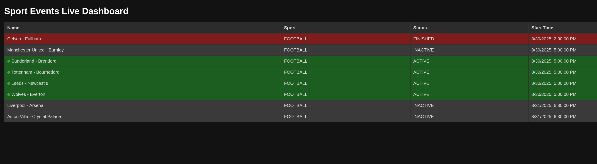

# Sport Events API

## Overview

Sport Events API is a CRUD REST API for managing sport events. It allows creating events, fetching events with optional
filters, updating event statuses, and subscribing to real-time updates via Server-Sent Events (SSE).

This project is built using **Java + Spring Boot** and uses an **in-memory store** for initial data storage,
making it lightweight and easy to run.

---

## Features

- Create a new sport event
- Retrieve all events with optional filters by status and sport type
- Get details of a specific event by ID
- Change the status of an event (`INACTIVE → ACTIVE → FINISHED`) with business rules enforced
- Subscribe to event updates using SSE
- OpenAPI (Swagger) documentation included
- **Simple frontend dashboard** for real-time monitoring of events

---

## Technical Stack

- Java 17
- Spring Boot 3+
- Lombok
- Springdoc OpenAPI for API documentation
- HTML + JavaScript (for frontend demo)

---

## Architectural Approach & Extensibility

The project is designed with **flexibility and future extensibility** in mind:

1. **DAO Interface Layer**  
   All data access is abstracted behind the `SportEventDAO` interface. This allows multiple implementations without changing the service layer.

2. **In-Memory Implementation**  
   The current implementation, `InMemorySportEventStore`, is simple, fast, and perfect for prototyping or tests.

3. **Future Database Support**  
   Adding a persistent storage backend (H2, PostgreSQL, etc.) is straightforward. Simply implement `SportEventDAO` for the chosen database, for example `DatabaseSportEventDAO`, without modifying the business logic.

4. **Service Layer Decoupling**  
   `SportEventService` interacts only with the DAO interface, so the underlying storage mechanism is interchangeable.

5. **OpenAPI Documentation**  
   All endpoints, request bodies, and responses are documented using OpenAPI annotations. This ensures clients can understand and integrate with the API easily.

6. **Extensible Sport Types**  
   Supported sports are **configured externally** via the `application.yml` file. This allows new sports to be added dynamically without changing the source code, making it easy to extend the list of available sports as needed.

---

## Frontend Dashboard

A simple **HTML + JavaScript dashboard** is included for demonstration purposes.  
It listens to **Server-Sent Events (SSE)** and displays sport events with live status updates.

- Access it at: [http://localhost:8080/dashboard](http://localhost:8080/dashboard)
- Events are rendered in a dark-themed table with **real-time updates**
- Active events are highlighted with a blinking green indicator
- Event data is persisted in **localStorage**:
   - If the data in `localStorage` is **fresher than 30 seconds**, it is displayed immediately on page load
   - If the data is **older than 30 seconds**, it is ignored and the dashboard fetches fresh data from the backend (`/events`)

### Screenshot

---

